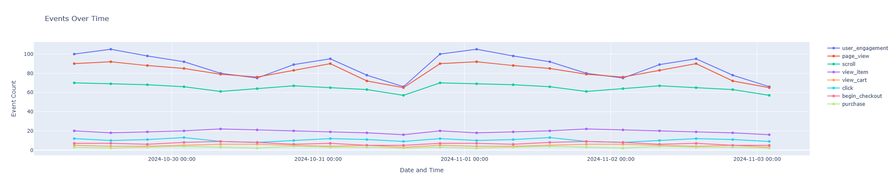
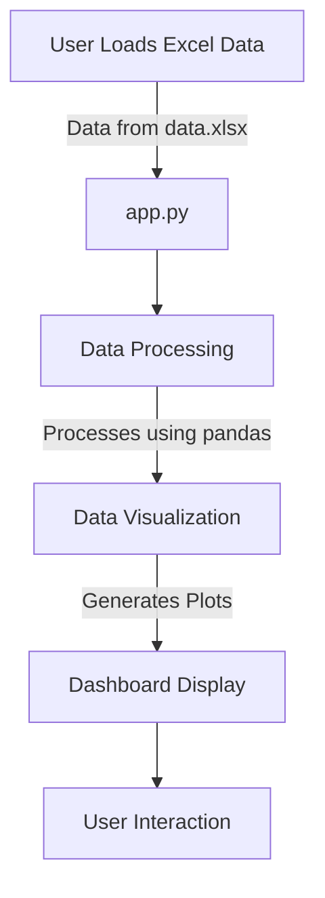

<h1 align="center">📊 <a href="https://github.com/ronknight/user-data-dashboard">User Data Dashboard</a></h1>

<h4 align="center">📈 A data visualization tool for analyzing user data using an Excel-based data source.</h4>

<p align="center">
<a href="https://twitter.com/PinoyITSolution"></a>
<a href="https://github.com/ronknight?tab=followers"></a>
<a href="https://github.com/ronknight/ronknight/stargazers"></a>
<a href="https://github.com/ronknight/ronknight/network/members"></a>
<a href="https://youtube.com/@PinoyITSolution"></a>
<a href="https://github.com/ronknight/user-data-dashboard/issues"></a>
<a href="https://github.com/ronknight/user-data-dashboard/blob/master/LICENSE"></a>
<a href="https://github.com/ronknight"></a>
</p>

<p align="center">
  <a href="#project-overview">Project Overview</a> •
  <a href="#files">Files</a> •
  <a href="#installation">Installation</a> •
  <a href="#usage">Usage</a> •
  <a href="#data-flow-diagram">Data Flow Diagram</a> •
  <a href="#disclaimer">Disclaimer</a>
</p>

---

## Project Overview

The **User Data Dashboard** is a Python-based data visualization tool that helps users analyze and visualize user data from an Excel file (`data.xlsx`). The project is ideal for generating insights from user analytics data in Excel format.

### Screenshot

*Sample Data Plot*


## Files

- **app.py** - Main application file for running the data dashboard.
- **data.xlsx** - Sample data file containing user analytics data in Excel format.
- **LICENSE** - License file for the project.
- **README.md** - Documentation for the project.
- **screenshot.png** - Screenshot of the dashboard interface.
- **sample-plot.png** - Example of a data visualization generated by the dashboard.

## Installation

To set up the project locally, follow these steps:

1. **Clone the repository**:
   ```bash
   git clone https://github.com/ronknight/user-data-dashboard.git
   cd user-data-dashboard
   ```

2. **Install dependencies**:
   Ensure you have Python installed. Then, install any required packages:
   ```bash
   pip install -r requirements.txt
   ```
   *(If `requirements.txt` is not available, manually install common packages like `pandas`, `openpyxl`, and any others used in `app.py`.)*

3. **Run the application**:
   ```bash
   python app.py
   ```

## Usage

1. **Prepare the Data**:
   - Export your user data to an Excel file (e.g., from Google Analytics).
   - Replace `data.xlsx` with your file, ensuring it has the expected structure.

2. **Launch the Dashboard**:
   - Run the app with `python app.py` to launch the dashboard.
   - Use the interface to explore and visualize data from the Excel file.

3. **Analyzing Data**:
   - The application will load data from `data.xlsx` and provide visual insights based on the data structure and columns in the file.

## Data Flow Diagram

This diagram illustrates the data flow within the **User Data Dashboard** application:



## ⚠️ Disclaimer

This project involves handling potentially sensitive user data. Ensure that you comply with all relevant data privacy regulations, including GDPR and CCPA, when working with user data. Only authorized personnel should have access to the data file (`data.xlsx`).
